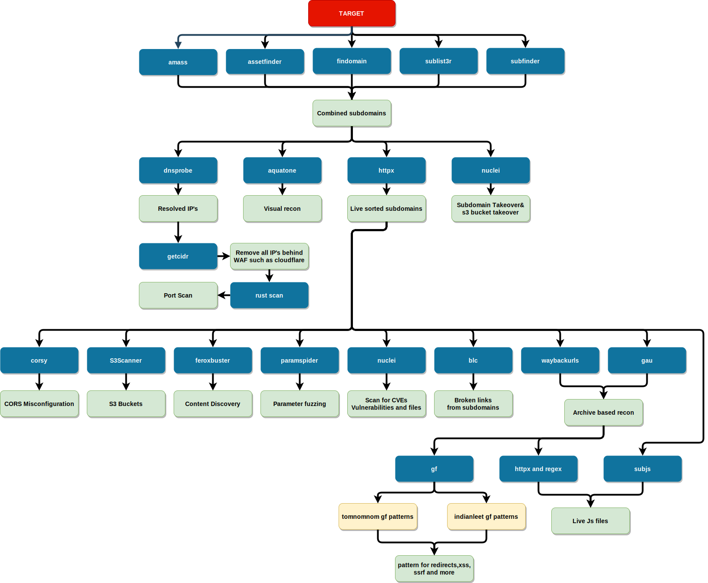
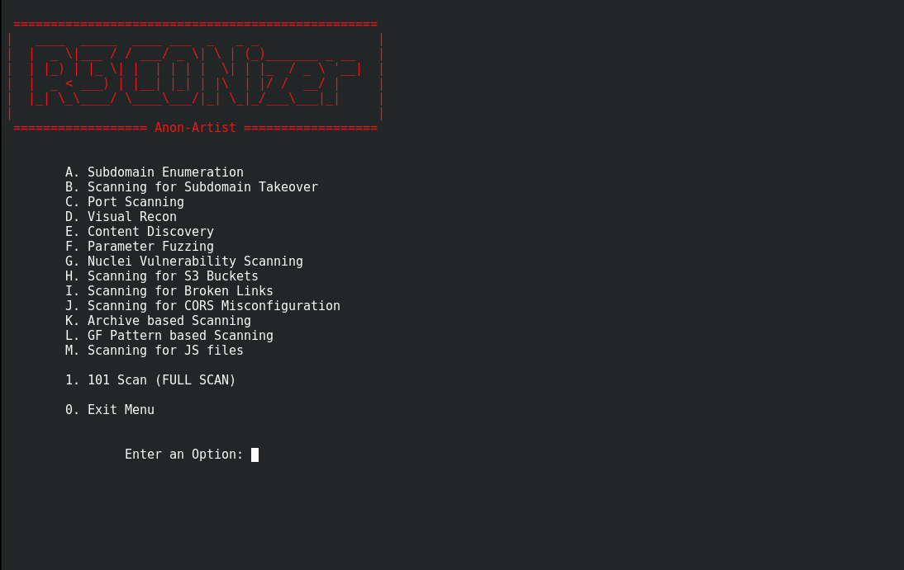

# About :superhero_man:
* Reconizer is the first ever CLI based menu-driven automated web application B-Tier recon framework which install every tools and dependencies while running each modules so that the user need not to install any tools manually and R3C0Nizer is used to gather some assets/informations which should help you to the next step with latest updated, fastest and efficient tools. HAPPY HACKING.

# Prerequisites :grin:
- python and python3
- golang
- docker
- chromium or chromium-browser

# Usage :clinking_glasses:
```
git clone https://github.com/Nabeel-Farooq/Reconizer

cd R3C0Nizer

chmod +x reconizer.sh 

echo "export PATH=$PATH:~/go/bin" | sudo tee -a ~/.bashrc

source ~/.bashrc

./reconizer.sh
```
# Read Wiki its important

# Workflow :muscle:


# Expecting Contributions :monocle_face:

R3C0Nizer is expecting contributions for improving the script such as 

 - Adding more assets
 
# Demo :boom:


-------

***Support this project by starring ⭐, sharing 📲, and contributing 👩‍💻! :heart:***

-------
